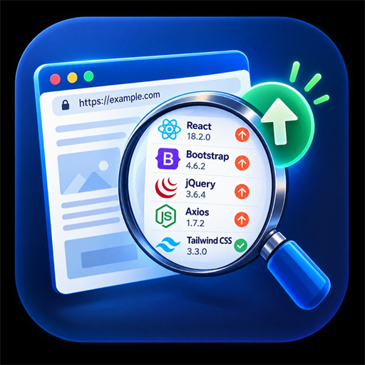

<p align="center">
  
</p>

<h1 align="center">Website Upgrade Detector</h1>

<p align="center">
  <strong>Production-Ready Microsoft Edge & Chrome Manifest V3 Browser Extension</strong><br>
  <em>by SkyDevLab</em>
</p>

<p align="center">
  
  
  
  
  
  
</p>

<p align="center">
  <a href="https://microsoftedge.microsoft.com/addons/detail/website-upgrade-detector/neiicihhckdhamhhmkinhgiiljknjnfo"><strong>🧩 Install on Microsoft Edge</strong></a> ·
  <a href="https://skydevlab.github.io/website-upgrade-detector/"><strong>🌐 GitHub Pages Website</strong></a>
</p>

---

## Discoverability

- **Maintainer:** [SkyDevLab](https://github.com/SkyDevLab)
- **Repository:** [SkyDevLab/website-upgrade-detector](https://github.com/SkyDevLab/website-upgrade-detector)
- **Category:** browser extension, web technology detection, frontend developer tools
- **Platform:** Microsoft Edge and Chromium-based browsers

## Overview

**Website Upgrade Detector** is a developer utility that detects JavaScript and CSS libraries used by the active website, determines their current versions, queries the official npm registry for latest published versions, and clearly displays which libraries have newer releases available.

### Core Philosophy
* **Zero Backend:** Runs entirely locally inside your browser; no servers, accounts, or telemetry.
* **Deterministic Detection:** Multi-signal inspection using runtime globals, `<script>` tags, `<link>` stylesheets, and DOM framework attributes.
* **SemVer 2.0.0 Accuracy:** Accurate numeric comparison handling major, minor, patch, and pre-release tags (`3.10.0 > 3.9.0`, `10.0.0 > 9.99.0`).
* **Major vs. Minor Categorization:** Distinguishes `⚠ Major version update available` (potential breaking changes) from safe patch/minor releases.
* **Smart 6-Hour Cache:** Saves latest versions in `chrome.storage.local` to minimize network queries, with a manual "Refresh Versions" bypass button.
* **Strict Privacy:** Zero transmission of website URLs, browsing history, cookies, DOM content, or personal identifiers.

---

## Supported Libraries & Package Mappings

| Library | Canonical npm Package | Primary Detection Signals |
| :--- | :--- | :--- |
| **React** | `react` | `window.React.version`, React DevTools hook, `data-reactroot`, script URLs |
| **Vue** | `vue` | `window.Vue.version`, `window.__VUE__`, Vue DevTools hook, scoped `data-v-*` CSS |
| **Angular** | `@angular/core` | DOM `[ng-version]` attribute, `window.ng.version.full`, script URLs |
| **jQuery** | `jquery` | `window.jQuery.fn.jquery`, `window.$.fn.jquery`, script URLs |
| **Bootstrap** | `bootstrap` | `window.bootstrap.VERSION`, `Tooltip.VERSION`, `--bs-*` styles, CSS links |
| **Tailwind CSS** | `tailwindcss` | `window.tailwind.version`, `cdn.tailwindcss.com`, `--tw-*` CSS custom properties |
| **Axios** | `axios` | `window.axios.VERSION`, client methods, script URLs |
| **Lodash** | `lodash` | `window._.VERSION` (verified Lodash methods), script URLs |
| **Moment.js** | `moment` | `window.moment.version`, script URLs |
| **Three.js** | `three` | `window.THREE.REVISION` (e.g. `180` normalized to `0.180.0`), script URLs |

*Special Package Mappings:*
- Angular maps directly to `@angular/core`.
- Tailwind CSS maps to `tailwindcss`.
- Three.js revisions (`r180` or `180`) normalize to `0.180.0` for semver compatibility with npm releases.

---

## Detection Strategy & Signal Priority

Detection follows a strict priority cascade to prevent false positives:
1. **Runtime / Global Version** (e.g. `window.jQuery.fn.jquery`, `window.React.version`)
2. **Script URL / CDN Version** (e.g. `https://unpkg.com/axios@1.7.2/...`)
3. **CSS Stylesheet Link Version** (e.g. `bootstrap@5.3.3/...`)
4. **DOM Metadata** (e.g. Angular's `[ng-version="17.2.1"]` root attribute)
5. **Unknown** (if library presence is verified without an explicit version string)

### Anti-False-Positive Rules
Weak variable matches (such as `window.react = "hello"` or generic `_` objects without Lodash utilities) are strictly rejected.

### Conflict Resolution
If multiple sources disagree (e.g. runtime is `3.6.4` while script URL is `3.5.1`), runtime is chosen as stronger evidence, and the conflict is transparently flagged in the expanded details card.

---

## Upgrade Status Badges

* **✓ Current:** Detected version matches or exceeds the latest published npm release.
* **⚠ Update available:** A newer patch or minor release is available on npm.
* **⚠ Major version update available:** A newer major version is available.
* **? Version unknown:** Library detected on page, but no version string was exposed.
* **⚠ Couldn't check latest version:** Library detected, but npm registry request failed (e.g. offline).

---

## Project Structure

```text
├── public/
│   ├── manifest.json         # Manifest V3 extension configuration
│   ├── icons/                # High-res extension icons (16, 32, 48, 128, 512)
│   └── testPages/            # Interactive test workbench
├── src/
│   ├── detectors/            # Modular library detectors
│   │   ├── jquery.ts
│   │   ├── react.ts
│   │   ├── vue.ts
│   │   ├── angular.ts
│   │   ├── bootstrap.ts
│   │   ├── lodash.ts
│   │   ├── axios.ts
│   │   ├── moment.ts
│   │   ├── three.ts
│   │   ├── tailwind.ts
│   │   ├── utils.ts          # Signal reconciler & DOM/Window extractors
│   │   └── index.ts          # Detector registry and runner
│   ├── npm/                  # npm Registry Client & Cache
│   │   ├── client.ts         # Direct registry fetcher
│   │   ├── cache.ts          # 6-hour TTL chrome.storage.local cache
│   │   └── packageMap.ts     # Technology-to-npm package mappings
│   ├── analyzer/             # SemVer & Upgrade Analyzer
│   │   ├── versionParser.ts  # SemVer parser, URL extractor, Three.js normalizer
│   │   ├── versionComparator.ts # Numeric SemVer comparison & major update checks
│   │   └── upgradeAnalyzer.ts   # Status calculation & summary metrics
│   ├── popup/                # Developer-focused React UI
│   │   ├── components/       # Modular UI components (Header, Summary, LibraryCard, etc.)
│   │   ├── App.tsx           # Main popup orchestrator
│   │   ├── main.tsx          # React mount entry
│   │   └── popup.css         # Modern dark-mode developer styling
│   ├── content/
│   │   └── contentScript.ts  # Page signal extractor & runtime listener
│   ├── background/
│   │   └── serviceWorker.ts  # Manifest V3 background service worker
│   └── shared/
│       └── types.ts          # Strongly typed shared contracts
├── store-assets/             # Microsoft Edge & Chrome Web Store graphic assets
├── tests/                    # Vitest unit test suite (40 tests)
├── testPages/                # Local testing workbench
├── LICENSE                   # MIT License
├── PRIVACY.md                # Official Privacy Policy
├── STORE_LISTING.md          # Store metadata & submission guide
└── package.json
```

---

## Development, Testing & Building

### 1. Install Dependencies
```bash
npm install
```

### 2. Run Unit Tests
```bash
npm test
```
Runs 40 comprehensive unit tests covering detectors, false positive resistance, semver parsing, numeric comparisons, and mocked npm lookups.

### 3. Type Checking
```bash
npm run typecheck
```

### 4. Build Production Bundle
```bash
npm run build
```
Outputs the ready-to-load extension into the `dist/` directory.

### 5. Package for Web Store Release (ZIP)
```bash
npm run package
```
Builds the project and creates `dist-zip/website-upgrade-detector-v1.0.0.zip` ready for direct upload to the **Microsoft Edge Add-ons Partner Center** and **Chrome Web Store Developer Dashboard**.

---

## Manual Testing in Microsoft Edge

1. Open **Microsoft Edge** and go to `edge://extensions`.
2. Enable the **Developer mode** toggle in the left sidebar.
3. Click **Load unpacked** and select the `dist/` directory.
4. Open the included interactive test workbench in Edge:
   ```text
   file:///c:/Users/suraj/source/repos/Website%20Upgrade/testPages/index.html
   ```
5. Click the **Website Upgrade Detector** icon in Edge's toolbar.
6. Click **Scan Website** to see live library detection and upgrade status.
7. Test the interactive toggles and preset scenarios (All 10 libraries, Mixed updates, Unknown version, Empty page) directly on the workbench.

---

## Publishing to Stores

Detailed copy-paste listings, descriptions, categories, and asset checklists are provided in [STORE_LISTING.md](STORE_LISTING.md).

* **Microsoft Edge Add-ons Partner Center:** https://partner.microsoft.com/dashboard/microsoftedge
* **Chrome Web Store Developer Dashboard:** https://chrome.google.com/webstore/devconsole

Upload the generated `dist-zip/website-upgrade-detector-v1.0.0.zip` and use the assets in `store-assets/`.

---

## Privacy Policy

Website Upgrade Detector does not collect, track, or share any personal information, browsing history, or website contents. For details, see [PRIVACY.md](PRIVACY.md).

---

## License

This project is licensed under the [MIT License](LICENSE) &copy; 2026 SkyDevLab.


## 👤 Author & Project Identity

**Website Upgrade Detector** is created and maintained by **Surya Pratap Singh (SkyDevLab)**.

GitHub: https://github.com/SkyDevLab
